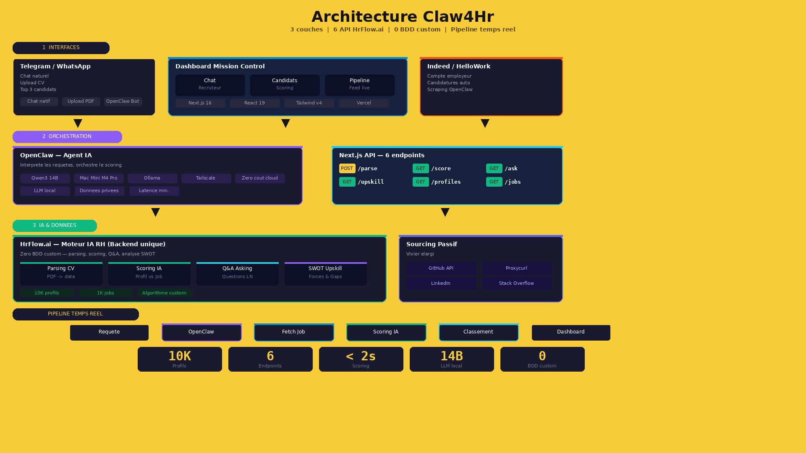

# Claw4HR — Passive Talent Intelligence

> AI recruiter agent: describe a role, get scored candidates instantly.

## What it does

A recruiter describes a position via chat (text or Telegram voice message). The agent:
1. Extracts criteria (skills, location, seniority) via NLP
2. Finds the most relevant job in the HrFlow board
3. Scores indexed profiles (10k+) using HrFlow AI Scoring
4. Displays top candidates with animated matching scores, clickable skills, and detailed profiles
5. Provides SWOT analysis (strengths/gaps) and Q&A per candidate

The real-time pipeline feed traces every step of the process.

**Live demo:** https://hrflowhackathon2026.vercel.app

## HrFlow.ai APIs used

- `GET /v1/profiles/searching` — List indexed profiles
- `GET /v1/profiles/scoring` — AI scoring of profiles against a job
- `GET /v1/profile/asking` — Q&A on a specific profile
- `GET /v1/profile/upskilling` — SWOT analysis (strengths + gaps)
- `POST /v1/profile/parsing` — Upload and parse a CV
- `GET /v1/jobs/searching` — List jobs from a board

## How to run

### Prerequisites

- Node.js 20+
- npm

### Setup

```bash
cd claw4hr-passive-talent-intelligence

# Install dependencies
npm install

# Copy environment variables
cp .env.example .env
# Then fill in your actual API keys in .env

# Start the app (dev mode)
npm run dev
# App runs at http://localhost:3000
```

### Environment variables

| Variable | Required | Description |
|----------|----------|-------------|
| `HRFLOW_API_KEY` | Yes | HrFlow.ai API key (prefix `ask_`) |
| `HRFLOW_API_EMAIL` | Yes | HrFlow.ai account email |
| `HRFLOW_SOURCE_KEY` | Yes | HrFlow.ai source containing profiles |
| `HRFLOW_BOARD_KEY` | Yes | HrFlow.ai board containing jobs |
| `HRFLOW_ALGORITHM_KEY` | Yes | HrFlow.ai AI scoring algorithm key |
| `PROXYCURL_API_KEY` | No | LinkedIn enrichment (Proxycurl) |
| `GITHUB_TOKEN` | No | GitHub passive sourcing |
| `OLLAMA_BASE_URL` | No | Ollama LLM endpoint |
| `OLLAMA_MODEL` | No | Ollama model (default: qwen3:14b) |

## Architecture

```
app/
  page.tsx                      Dashboard 3-column layout
  layout.tsx                    Layout with Geist font
  globals.css                   Dark "mission control" theme + animations
  components/
    TopBar.tsx                  Status bar (OpenClaw, Indeed, HrFlow connections)
    Dashboard.tsx               Main orchestrator (state, fetch, layout)
    WhatsAppPanel.tsx           Recruiter chat (left panel)
    CandidatePanel.tsx          Candidate cards with scoring (center)
    AgentFeed.tsx               Real-time agent pipeline feed (right)
  lib/
    hrflow.ts                   Centralized HrFlow client
    types.ts                    TypeScript types
  api/hrflow/
    parse/route.ts              POST — Upload & parse CV
    score/route.ts              GET  — Score profiles vs job
    ask/route.ts                GET  — Q&A on a profile
    upskill/route.ts            GET  — SWOT analysis profile vs job
    profiles/route.ts           GET  — List indexed profiles
    jobs/route.ts               GET  — List board jobs
  api/openclaw/
    webhook/route.ts            POST — Receive OpenClaw events
    events/route.ts             GET  — Dashboard polling (cursor-based)
```

## Screenshots



## Stack

- **Frontend**: Next.js 16, React 19, Tailwind CSS v4
- **Backend**: Next.js API Routes
- **AI/HR**: HrFlow.ai (parsing, scoring, asking, AI algorithm)
- **Orchestrator**: OpenClaw
- **LLM**: Ollama + Qwen3 14B
- **Chat**: Telegram (via OpenClaw)

## Team

- **Matki** — Frontend/Backend Developer
- **Emile** — OpenClaw Integration
