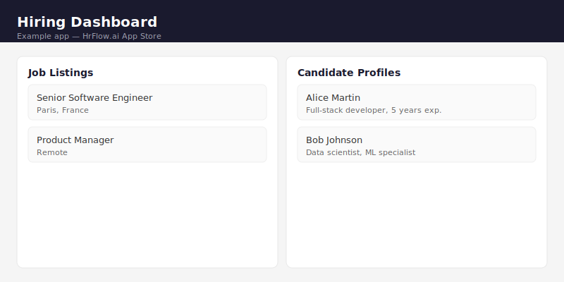

# Hiring Dashboard

> A lightweight hiring dashboard that displays job listings and candidate profiles from HrFlow.ai APIs.

## What it does

This is an example app demonstrating the HrFlow.ai App Store submission format. It's a single-page HTML dashboard that fetches and displays:

- **Job listings** from a HrFlow board via the Jobs Searching API
- **Candidate profiles** from a HrFlow source via the Profiles Searching API

The app is intentionally simple (vanilla HTML/CSS/JS, no build step) to illustrate that submissions can use any stack.

## HrFlow.ai APIs used

- `GET /v1/jobs/searching` — Search and list job postings from a board
- `GET /v1/profiles/searching` — Search and list candidate profiles from a source

## How to run

### Prerequisites

- A modern web browser
- HrFlow.ai API credentials (provided by hackathon organizers)

### Setup

1. Copy the environment template:
   ```bash
   cp .env.example .env
   ```
2. Fill in your actual API keys in `.env`
3. Open `index.html` in your browser

Since this is a static HTML file, environment variables are entered directly in the UI (the `.env.example` documents what's needed for reference).

### Environment variables

| Variable | Required | Description |
|----------|----------|-------------|
| `HRFLOW_API_KEY` | Yes | HrFlow.ai API secret key |
| `HRFLOW_SOURCE_KEY` | Yes | HrFlow.ai source key for candidate profiles |
| `HRFLOW_BOARD_KEY` | Yes | HrFlow.ai board key for job listings |

## Screenshots



## Team

- **HrFlow Team** — Lead
