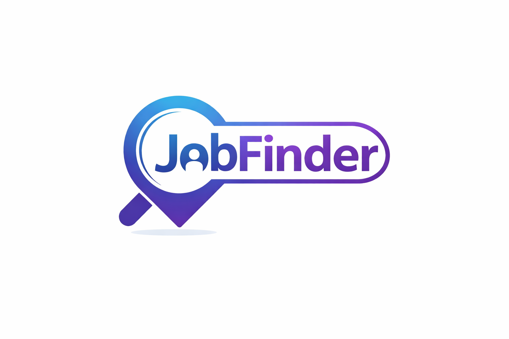

# JobFinder — AI-Powered Job Search Assistant

> **HrFlow.ai Hackathon Submission** · Team: Franck Ulrich Kenfack



JobFinder is a full-stack application that automates your job search using **HrFlow.ai** for intelligent profile-job matching, CV parsing, and semantic search — combined with **Claude (Anthropic)** for personalized career advice and document generation.

---

## What it does

| Feature | HrFlow.ai API used |
|---|---|
| **Upload CV → auto-extract profile** | `profile.parsing.add_file` |
| **Index profile for AI matching** | `profile.storing.add_json` |
| **Scrape & index job offers** | `job.storing.add_json` |
| **Personalized job feed** (ranked by compatibility) | `job.scoring.list` |
| **Semantic job search** by keywords/skills | `job.searching.list` |
| **Match explanation** (strengths & weaknesses) | `job.reasoning.get` |
| **Skill extraction** from job descriptions | `text.tagging.post` |
| **Text vectorization** for similarity | `text.embedding.post` |
| **Ask questions about a profile** | `profile.asking.get` |
| **Ask questions about a job** | `job.asking.get` |

### AI Chat Assistant

A Claude-powered chat interface that understands your profile and the HrFlow.ai job data to give personalized advice:

- 🔍 *"Find me Python jobs in Paris"* → ranked job cards with compatibility scores
- 📊 *"Analyze my compatibility with Senior Python Developer"* → score bar + strengths/weaknesses from HrFlow Reasoning
- 💡 *"Prepare me for the TechCorp interview"* → AI-generated questions with personalized tips
- 📄 *"Generate my CV for this job"* → tailored PDF CV
- 📝 *"Write a cover letter"* → personalized cover letter

---

## Architecture

```
┌─────────────────────┐     ┌──────────────────────────┐
│   Next.js 14        │────▶│   FastAPI + SQLAlchemy    │
│   (React/TS UI)     │     │   (REST API, JWT auth)    │
└─────────────────────┘     └────────────┬─────────────┘
                                          │
                    ┌─────────────────────┼──────────────┐
                    ▼                     ▼              ▼
             ┌──────────┐        ┌──────────────┐  ┌─────────┐
             │PostgreSQL│        │  HrFlow.ai   │  │  Redis  │
             │+pgvector │        │  (SDK v3.3)  │  │(cache+  │
             └──────────┘        └──────────────┘  │ Celery) │
                                                    └─────────┘
```

**Backend:** Python 3.11, FastAPI, SQLAlchemy (async), Alembic, Celery
**Frontend:** Next.js 14 (App Router), React 18, TypeScript, Tailwind CSS
**AI:** HrFlow.ai SDK v3.3, Anthropic Claude (haiku-4-5), OpenAI (fallback)
**Infrastructure:** Docker Compose, PostgreSQL 16 + pgvector, Redis 7

---

## Prerequisites

- Docker & Docker Compose
- HrFlow.ai account with a **Source** and a **Board** configured
- Anthropic API key (Claude)

---

## Quick Start

### 1. Clone the repository

```bash
git clone https://github.com/kenfackfranck08/hackaton_hrflow.git
cd hackaton_hrflow
```

### 2. Configure environment variables

```bash
cp .env.example .env
```

Edit `.env` and fill in:

| Variable | Where to get it |
|---|---|
| `HRFLOW_API_KEY` | [HrFlow.ai Dashboard](https://hrflow.ai) → Settings → API Keys |
| `HRFLOW_USER_EMAIL` | Your HrFlow.ai account email |
| `HRFLOW_SOURCE_KEY` | HrFlow.ai → Sources → your source key |
| `HRFLOW_BOARD_KEY` | HrFlow.ai → Boards → your board key |
| `CLAUDE_API_KEY` | [Anthropic Console](https://console.anthropic.com) |
| `SECRET_KEY` | Run: `openssl rand -hex 32` |

### 3. Start the application

**Development:**
```bash
docker-compose up -d
```

**Production:**
```bash
docker-compose -f docker-compose.prod.yml up -d
```

### 4. Initialize the database

```bash
docker-compose exec backend alembic upgrade head
```

### 5. Open the app

- **Frontend:** http://localhost:3000
- **API docs:** http://localhost:8000/docs

---

## Project Structure

```
hackaton_hrflow/
├── backend/
│   ├── app/
│   │   ├── api/            # FastAPI route handlers
│   │   ├── services/       # Business logic
│   │   │   ├── hrflow_service.py     # HrFlow.ai wrapper (all 11 APIs)
│   │   │   ├── chat_service.py       # Claude AI chat with HrFlow context
│   │   │   ├── ai_service.py         # CV/cover letter generation
│   │   │   └── scraping_service.py   # Multi-source job scraping
│   │   ├── models/         # SQLAlchemy models
│   │   └── config.py       # Pydantic settings
│   └── requirements.txt
├── frontend/
│   ├── src/
│   │   ├── app/            # Next.js App Router pages
│   │   │   ├── chat/       # AI chat interface
│   │   │   ├── jobs/       # Job search & management
│   │   │   ├── profile/    # Profile management
│   │   │   └── dashboard/  # Personalized feed
│   │   └── components/
│   └── package.json
├── docker-compose.yml
├── docker-compose.prod.yml
└── .env.example
```

---

## HrFlow.ai Integration Details

The `hrflow_service.py` module is a centralized wrapper for all HrFlow.ai interactions:

```python
hrflow_service.parse_resume(file_content, file_name)       # CV parsing
hrflow_service.index_profile(profile_data)                 # Profile indexing
hrflow_service.index_job(job_data)                         # Job indexing
hrflow_service.score_jobs(profile_key, board_keys)         # Job scoring
hrflow_service.search_jobs(query, board_keys)              # Semantic search
hrflow_service.explain_job(profile_key, job_key)           # Match reasoning
hrflow_service.tag_text(text)                              # Skill extraction
hrflow_service.vectorize_text(text)                        # Embeddings
hrflow_service.ask_profile(profile_key, question)          # Profile Q&A
hrflow_service.ask_job(job_key, question)                  # Job Q&A
```

All methods include graceful fallback — if HrFlow.ai is unavailable, the app continues to work with local data.

---

## Chat Demo Scenario

Visit `/chat` after login to see the AI assistant in action:

1. Click **"🔍 Trouve-moi des offres Python à Paris"**
   → 4 ranked job cards with HrFlow.ai compatibility scores

2. Click **"📊 Analyse ma compatibilité avec Senior Python Developer"**
   → Score bar (87%) + green strengths section + orange weaknesses section

3. Click **"💡 Prépare-moi pour l'entretien chez TechCorp"**
   → 5 interview questions with personalized coaching tips

---

## Environment Variables Reference

| Variable | Required | Description |
|---|---|---|
| `DATABASE_URL` | ✅ | PostgreSQL connection (asyncpg driver) |
| `SECRET_KEY` | ✅ | JWT signing key (32+ chars) |
| `REDIS_URL` | ✅ | Redis for caching and Celery |
| `HRFLOW_API_KEY` | ✅ | HrFlow.ai API secret |
| `HRFLOW_USER_EMAIL` | ✅ | HrFlow.ai account email |
| `HRFLOW_SOURCE_KEY` | ✅ | HrFlow.ai Source key (profiles) |
| `HRFLOW_BOARD_KEY` | ✅ | HrFlow.ai Board key (jobs) |
| `CLAUDE_API_KEY` | ✅ | Anthropic Claude API key |
| `NEXT_PUBLIC_API_URL` | ✅ | Backend URL (browser-accessible) |
| `OPENAI_API_KEY` | ⬜ | OpenAI fallback |
| `SMTP_*` | ⬜ | Email notifications (optional) |

---

## Author

**Franck Ulrich Kenfack**
GitHub: [@kenfackfranck08](https://github.com/kenfackfranck08)

Built for the **HrFlow.ai Hackathon 2026** 🚀
