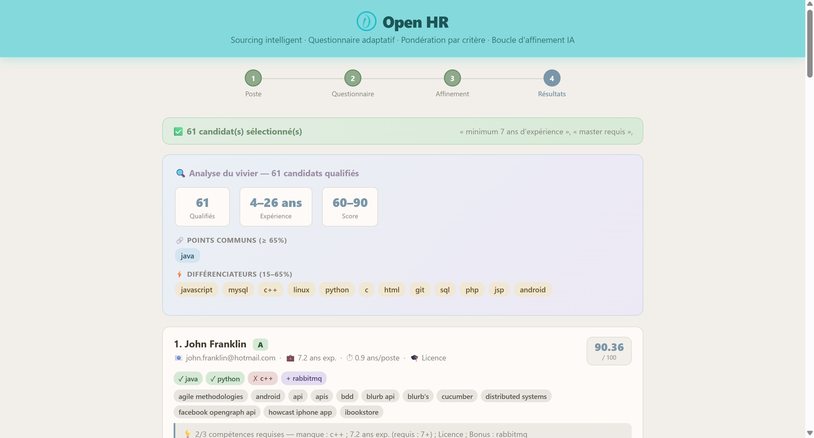

# Open HR avec HrFlow.ai

> Intelligent candidate sourcing with auto-generated questionnaires and HrFlow.ai-powered scoring.

## What it does

Open HR is an AI sourcing agent built for recruiters. Given a job title and requirements, it:

1. **Auto-generates a weighted questionnaire** from the job description (skills, experience, education, stability)
2. **Indexes the job** via HrFlow.ai Job Indexing API
3. **Scores all candidates** in the source using HrFlow.ai Scoring API with a custom algorithm key
4. **Combines AI scores with questionnaire weights** to produce precise decimal rankings
5. **Allows refinement** via natural language feedback loop

## HrFlow.ai APIs used

- `POST /v1/job/indexing` — Index job description to enable scoring
- `GET /v1/profiles/scoring` — Score all profiles against the job using algorithm key
- `GET /v1/profiles/searching` — Fallback profile search
- `POST /v1/profile/indexing` — Index candidate profiles

## How to run

### Prerequisites

- Python 3.11+

### Setup

```bash
# Install dependencies
pip install -r requirements.txt

# Copy environment variables
cp .env.example .env
# Fill in your HrFlow API keys in .env

# Start the app
uvicorn web_app_fr_v2:app --host 0.0.0.0 --port 8002
```

### Environment variables

| Variable | Required | Description |
|----------|----------|-------------|
| `HRFLOW_API_KEY` | Yes | HrFlow.ai API secret key |
| `HRFLOW_USER_EMAIL` | Yes | HrFlow.ai account email |
| `HRFLOW_SOURCE_KEY` | Yes | HrFlow.ai source key |
| `HRFLOW_BOARD_KEY` | Yes | HrFlow.ai board key |

## Screenshots



## Team

- **yanfr-lab** — Full-stack development & HrFlow.ai integration
